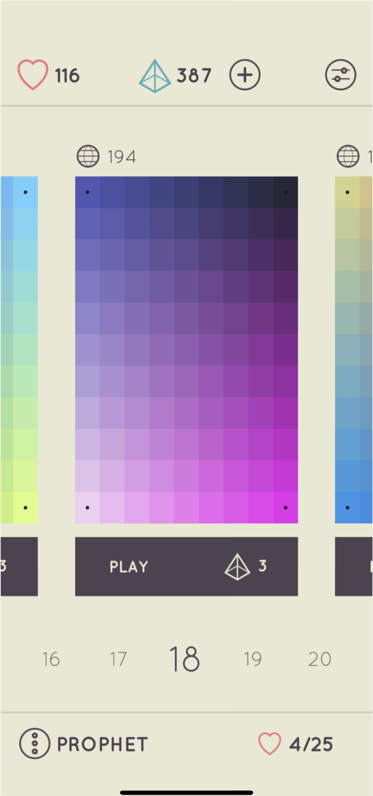
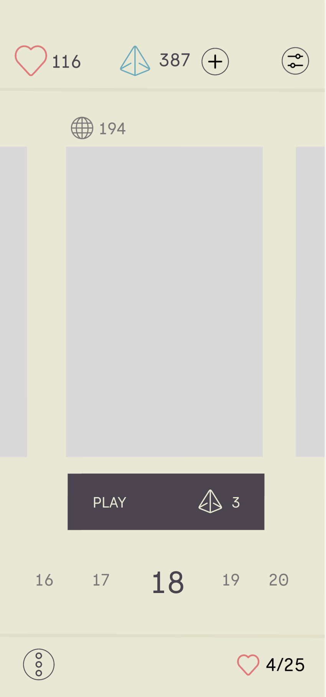
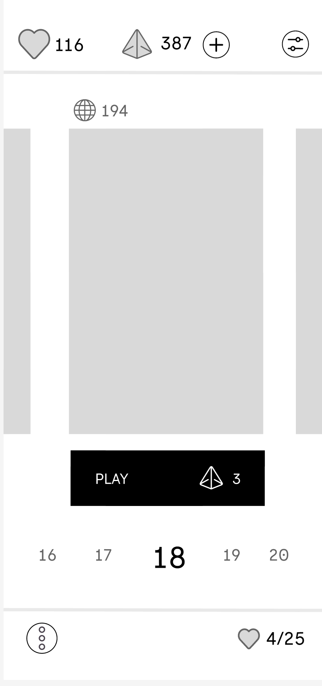
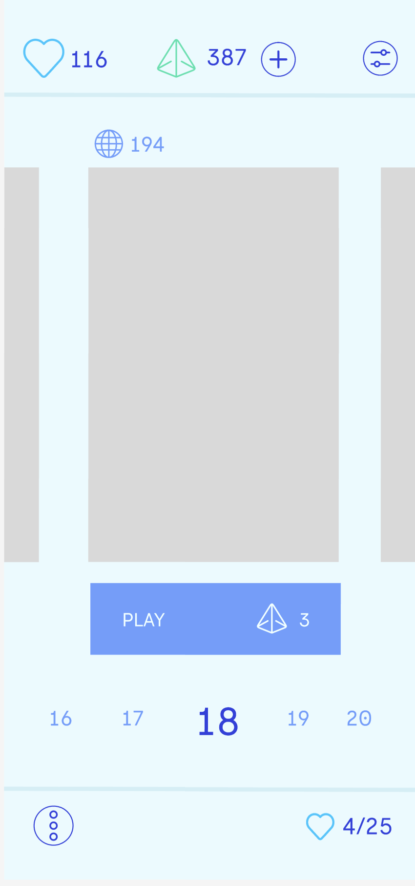
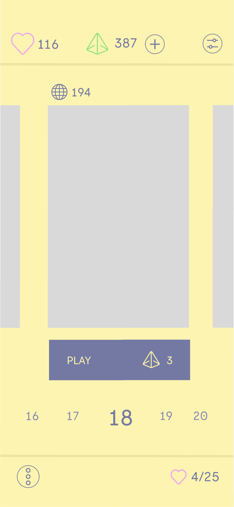

##Color Harmony UI Excercise 

Today I will be embarking on a journey exploring different color harmonies impact on
an interface. I thought what better interface to experiment with than the color puzzle game
"I Love Hue"! I will first analyze and recreate the original palette of this interface and then spin up three different iterations of this interface with different harmonic color
combinations. 

##Original Interface

##Recreation of Interface

The original color scheme of the I love hue interface fits into the triad harmony, these 
being the primary colors of yellow, red, and blue. This color scheme exemplifies simplicity and harmony. I think this was a very intelligent choice from the designers as primary colors
are the foundation of the game which tests users eye for colors and how each hue fits together.  As this is a relaxing low stakes puzzle game I think these muted colors work very well to not excite the mind too much and allow the player to relax and focus on the colors of the puzzle to solve.

##Achromatic Interface

The first color scheme I tried my hand at was an achromatic color scheme using 
black and white and all the shades in between those colors. This was my favorite new
iteration by far. It stays true to the values of simplicity and ease on the mind.This sleek,
simple palette allows for the colors of the puzzle to truly shine and be the main focus of
the game. This also thematically fits well into the game similar to their primary triad
harmony.

##Anagolous Interface

The next color harmony I tried was an analogous color palette. I used blue, blue green and 
blue violet. I choose to use a blue analogous palette as blue evokes feeling of peace and 
relaxation which fits the purpose of the game. I think this palette is very soothing to the 
eye and mind, however it has more potential to clash based on the colors of the puzzle. I think the fact certain color puzzles will stand out and pop far more than others is a detriment to this design.

##Square Interface

The last color harmony I tried out is a square color harmony. I used red, green, purple
and yellow. I wasn't the biggest fan of this palette as it gave it a more childish, chaotic
look compared to the other choices. I think this would also clash with the palettes of
the puzzles potentially. I think this gives the energy of a more fast paced, energetic game
rather than the slow, meticilous process i love hue creates.

##Final Thoughts
Overall I think the original color scheme was the most effective for this game. It
was very purposeful and truly lives up to the name of the game by incorporating
all the primary colors. The point of the game is to get lost in the world of color
and relax and the triad harmony is a wonderful vessel to present this. The achromatic
palette is a close second due to the reasons I love the original palette so much. 
It doesn't distract from the puzzle which is the central focus and creates a feeling
of peace and calmness. 