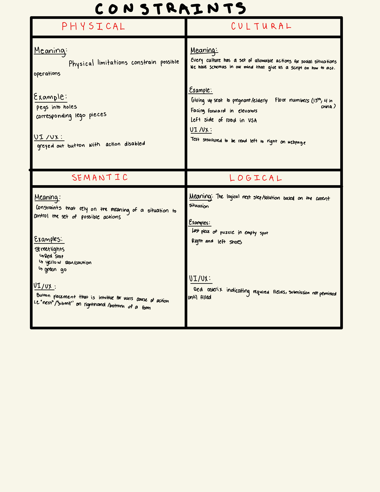

Constraints Concept Map

I decided to map out the four types of constraints detailed in chapter 4 of
"The Design of Everday Things". These tie deeply into the concepts of signifiers
and affordances and are at the corner stone of guiding users easily on how to
use and navigate sites and designs they have no concept of in the past. These
constraints are vital to remember and leverage to faciliate a user experience that builds upon users existing knowledge base.
