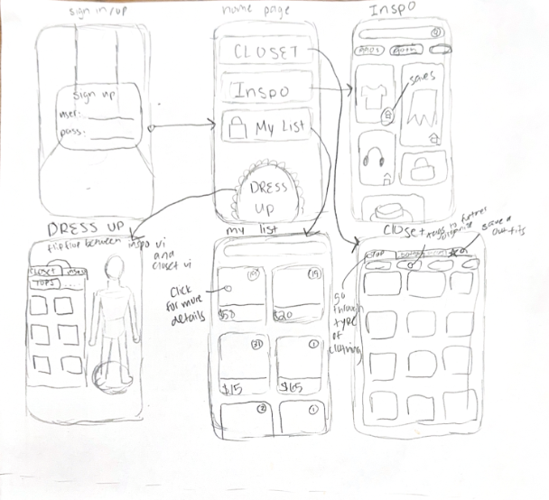
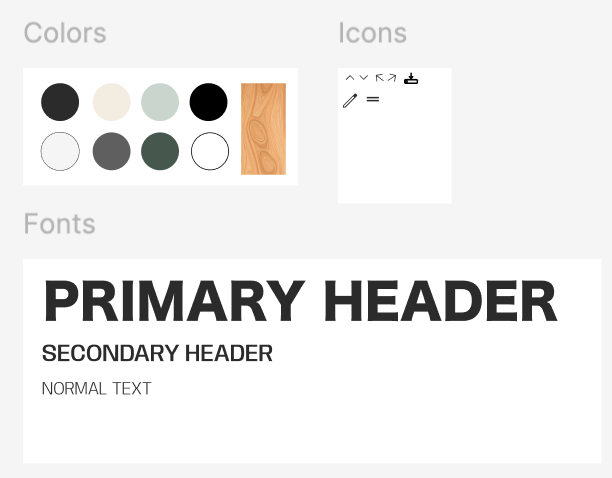

Today I will be walking you through the long but fulfilling semester long journey towards my finalized UI/UX design for my own original mobile application! I decided to tackle this task alone as I had more than enough inspiration and excitement towards an application idea which has been at the back of my mind for some time.

I primarily attribute two preexisting creations to my project vision. The first was a personal styling app called “Stylebook”. In the midst of the pandemic with nowhere to go but all the time on my hands, I decided to kill two birds with one stone: first filter and trim down on the massive amount of clothes I had acclimated over the years and second to catalogue and play around with different outfits and style aesthetics using my clothing to create options to save myself time and explore my creativity and style. However, after the massive initial time sink of using this app which took hours of photographing, editing, and documenting all my clothes I found the actual process they had for putting together outfits underwhelming. There were too many unaccounted variables and a quite draining and uninspiring app design that didn’t succeed in capturing my gaze. However, this planted the necessary seeds for my design I will be presenting today. Several years later but coincidentally aligning with the period I embarked on this project; I got into the hit Roblox game “Dress to Impress”. This game reignited my love for the creativity and confidence that blooms through finding your personal style and most important the wealth of options at my fingertips with the fixed amount of clothing I already own. Combining the novelty and creativity of Dress to Impress with the functionality of Stylebook I was able to find the values which guided my love for these concepts which is creativity and sustainability.  These values then directed how I would create my own design to go above and beyond the benefits these inspirations offered.

With my inspiration, values, and initial concept fresh in my mind I continued to ideate on what this application and design would manifest as. Individually, I had a large stake in this design as I fell into the target audience, however if I wanted to create an accessible and meaningful user facing design I would have to reach out and get many perspectives other than my own. So, I conducted several user interviews and from there shaped a user persona and story for my personal style app! Through my user interviews I was able to deduce some audience pain points and needs which would guide my design. Some important considerations were the impact of trying on clothes in a physical versus digital space, the cost and waste of purchasing new clothing items, wanting to maximize items a person already owns, and wanting to feel confident and assured in the outfits they decide to wear. From this I formed the narrative our user persona “April” a college girl strapped for cash but wanting to explore her unique taste and interest in renaissance era styles while cutting back on her fast fashion spending and her mental block of wanting to fit in but not feeling as confident in the standard fashion seen at her university.

By preparing through interviewing and creating a narrative I had the right direction to create my low fidelity sketches of my application. One of the most important components of my application I quickly narrowed down was that it would be a mobile application. This app is meant to save time and create a feeling of comfort that allows individuals to express their creativity. Mobile devices are optimal as they have that built in ease of access and familiarity. I also fleshed out the core functionality which would be a closet, wish list, inspiration, and clothing studio pages.

With my initial sketch outlined I now had the confidence to continue creating my design system! At this point the opportunities were endless on what to tackle first for my design. I have always been someone who prioritized having all my ingredients measured out and in hand before I begin the “recipe”, so I first began by playing around and finalizing my favorite color schemes, typography and overall design aesthetic. Pinterest was a huge help and guiding force in this area and I found myself falling in love with the “brutalist” UI design style which I found ironic considering my hatred for brutalist architecture. Knowing I was taking a brutalist direction I prioritized modern, bold and blocky fonts, desaturated neutral colors, thin and sharp lines and corners, and lots of white space and overall simplicity.

Once I had these foundational aspects alongside shared components between pages I decided to start with the “Studio” page which was the most exciting problem to tackle personally and the section of my application which would create the most value based on my narrative. There were many challenges along the way as I was balancing an information and choice heavy application with a modern and sleek design, especially on the studio page which combines every other page into one interface. I thought my initial sketch would be sufficient to dive straight into designing, but I found myself delving deeper and deeper into the nuances of each page and possible action. I often kept reiterating on these low fidelity sketches to clear up any questions before and as I worked in Figma.

Initial Prototype
<iframe style={{border: "1px solid rgba(0, 0, 0, 0.1)"}} width="800" height="450" src="https://embed.figma.com/design/UK9uUpAhDIBDZ92RVxjQA3/Final-Project-Design-System?node-id=0-1&embed-host=share" allowfullscreen></iframe>
After many long nights and hours spent on finalizing the prototype, it was time to take it to the chopping block: conducting user tests. I conducted user tests with a colleague from my class and an external person that fit my target audience. I placed the design in front of them and did a more unstructured test with my colleague and a more structured test for the specific user I chose. The first test had quite vague directions and mostly aimed to see people's first impressions and intuition when faced with my design. The structured test had more specific instructions which really put the functionality of my application to the test. This was a super constructive and insightful experience which gave me lots of important insights on things that I had slightly thought about or had completely skipped my mind as I was so used to the design I had been working on. I was really pleased that my users were impressed by the aesthetics, vibe, and diversity of my application. These were things I had the most fun working on and probably put the most time into, so I was happy that hard work paid off. Most of the usability concerns regarded understanding things that were associated and presented in front of them. The consensus was that the structure and design were solid but there were small tweaks and areas that could be modified for more ease of use and understanding of affordances.

I will now delve into the specific usability concerns I decided to tackle as they were of the highest priority and a sentiment echoed across my user tests.

1. **Save button in studio**  
  The lack of clarity behind the icon I chose was a usability issue I encountered time and time again with the save outfit functionality in the studio page. As this is the crux of the creativity and purpose of the app with users creating and cataloging their preferred items, it was vital for me to make this clearer. I noticed that there were several icons available that could indicate wanting to save something and while I thought the one I chose was sufficient, my colleagues said it looked more like an upload button. I went for a slightly embellished but overall very simple check mark to indicate where to save your outfit and relinked all the necessary interactions.

2. **Pictures and Text associations**  
  This was another usability issue which slipped my mind as I was working and seeing the same thing repeatedly but something that popped up with the fresh set of eyes my colleagues gave me. This was a hard one for me to implement as I was very satisfied with the design of my home page and thought the arrows and text were sufficient to indicate what goes together. I didn’t want to sacrifice the geometric lines I had put throughout the whole main page as I thought that was a huge part of the aesthetic appeal. However, I took the leap and got rid of the lines and ended up liking this design a lot more with the bonus of better readability!

3. **Studio Clothing Collapsible menu**  
  I knew this was bound to show up in my user testing as I had been struggling to implement it in Figma and put it on the back burner due to my issues in implementing an expandable and collapsible sidebar menu for all the clothing in their respective sections. This adds so much to the design as users can scroll through and see the potential of this feature rather than having a fixed menu only showing skirts. After trial and error with creating components and auto layout, I was able to accomplish this advanced functionality in Figma and have it fit in perfectly with the overall Studio page.

4. **Text on Home Page**  
  I got lots of feedback on the readability of the home page and there were several directions I could go. I decided to add blurbs for each section to immediately key in users on what each section is intended to do and the overall narrative for the purpose of the application.

5. **Clickable Areas**  
  This was another recurring concern I received especially as this is a mobile application. Rather than completely redesigning and reworking my interactions, I instead gave users more options and freedoms for clickable areas and different gestures so they can’t really mess up and the flow of the application wasn’t compromised.

User Testing Changes
<iframe style={{border: "1px solid rgba(0, 0, 0, 0.1);"}} width="800" height="450" src="https://embed.figma.com/design/vMADeAuVf2QUHi2hdHYOT4/Final-Project-Design-System-(Copy)-(Copy)?node-id=0-1&embed-host=share" allowfullscreen></iframe>
