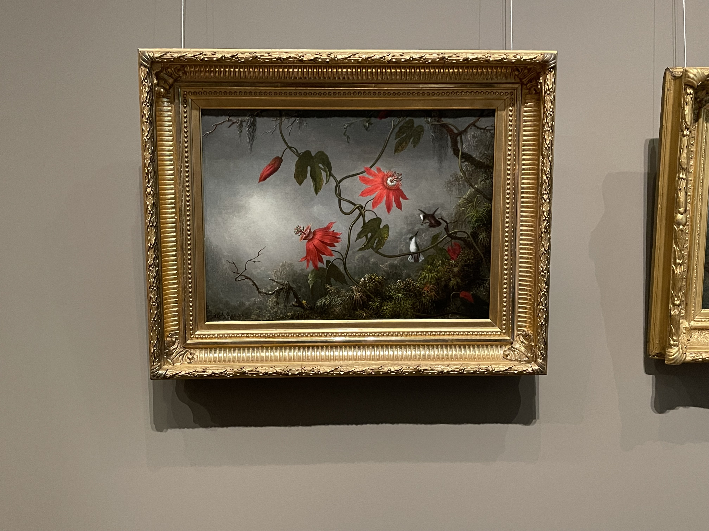

##Finding Inspiration Through Art

##Passion Flowers and Hummingbirds by Martin Johnson Heade

A couple of yearsa ago I visited the Boston Museum of Fine Arts and found myself enamored by 
several pieces. After some time I still find the piece “Passion Flowers and Hummingbirds” by the American artist Martin Johnson Heade to be the most compelling. The creation of this painting spanned from 1870-1883. One of the most fascinating parts regarding the history of this piece is how Heade was inspired by the revolutionary knowledge of Charles Darwin’s studies on evolution. He already had a fascination with hummingbirds since childhood and this was further exacerbated by Darwins example of hummingbird beak adaption for the purpose of fertilizing hummingbirds. During his trip to Central America he painted the interrelationship between flora and fauna he saw in Panama while also integrating spiritual elements of Christianity through nuances within the form of his paintings. 

##Art Analysis

##Saturation
https://drawpaintacademy.com/color-saturation/

Heade masterfully uses saturation guide the viewers eye to the most important parts of the painting and set the mood. The passionflower are the intended focus of this painting and Heade drives this point home using a vibrant, highly saturated shade of red. The color context is important with this choice as the passionflowers are the most saturated hue present in this painting. If the vines and leaves adorning the flowers were the same level of saturation the pop the passionflowers give would get washed out and thus have less impact Atmospheric perspective is another component of this painting which means as an object recedes, it mirrors its surrounding appearance more. One component of this means that as an object is more in the background it tends to be less saturated and more dull which is clearly seen in the brush and fog in this painting. This is also a component of depth which will be discussed in the next section! 

##Depth
https://www.bbcmaestro.com/blog/creating-depth-in-art

Creating depth in an artwork is achieved through choices that leverage the facets of color and how the human eye works. Despite this being a flat canvas the painting looks to be a snapshot of a bundle of flowers lost in an imposing, foggy jungle that goes as far as the eye can see. As previously mentioned atmospheric depth is one way to do this as objects in the background will be far more dull and desaturated. Another way this illusion of depth is refined is through detail and focus. This is best seen through how Heade painted the jungle brush. The brush that is seen at the bottom of the canvas has clear individual leaves where light hits the tops of them and underneath eacb leaf is shrouded in shadow. Going to the brush slightly above that, the shadows become more blurry and muted and the colors blend together more creating a lower resolution look which corresponds to being further away. These are all further driven home through value which will be discussed in the final section of contrast!

##Contrast 
https://www.studiobinder.com/blog/what-is-contrast-in-art-definition/

The final component that brings together this painting is contrast! Contrast is a fascinating feature of art due to manifesting in several different ways. The primary way is through complementary colors which are opposite colors on the color wheel. This is present in the painting through the vibrant red flowers and the muted green foliage. The next way is the contrast between dark and light or value. The passionflower closest to the hummingbirds has the brightest red colors even among the other flowers which indicates it is the first thing Heade wanted the viewer to look at. Not only does he use saturation to differentiate different elements in the painting, but the same objects as well. There is an also contrast present between the bright fog and the dark foliage. Lastly the size of the elements create contrast which is seen through the large, highly detailed flowers in the foreground and the much smaller foliage as the painting gets further away. These all work together to create depth and visual interest. 

#You should take a photo or scan of your sketch and add it to your blog post. Then, describe your UI. What kind of device is it intended for (web, mobile, treadmill, etc.)? What is the page's topic (calendar app, news site, Starburst-themed casino machine, etc.)? What about the inspiration piece are you replicating in this sketch?
Finally, conclude your post with something insightful you learned through this process.
Go get inspired!

##Inspiration Sketch

The UI I sketched up is intended to be used on the web. 