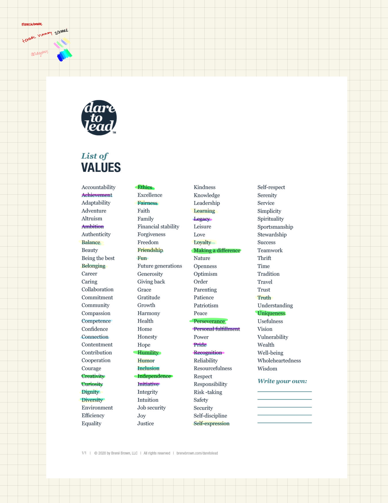

---
title: Designs Systems
slug: /design-systems
date: 2024-10-11T14:30:00Z
tags: [freeform]
---Brene brown list of 100 values

To further identify my own  values I was inspired and decided to loosly 
follow the excercise from Brené browns
book <i> Dare to Lead </i>.

The first step of this excercise is to identify the values 
that we initially connect with.This is indicated by all the values which have 
been highlighted in the image. The values highlighted purple indicate the values 
under the main value Achievment, the values highlighted green fall under 
Groth, and the blue ones embody Belonging.

After this I drilled down even further on what two
overarching values encapsulate the initial group
of values I selected.I ended up with:

"Authenticity": Achievement, Ambition, Initiative,
Personal Fulfillment, Belonging, Balance, Ethics
,Creativity, Curiosity, Humility, Independence,
Perseverance,Uniqueness

"Legacy"
Legacy,Pride,Recognition,Self-Expression, Loyalty, Learning, Inclusion,
Humor,Fun,Friendship,Fairness,Diversity,Dignity,Connection,Competence
,Making a Difference

Finally, I created two sentences to concisely communicate the 
scope of these core two values and all the context from
other values to personalize it to my perspective. 

Authenticity expresses the way I want to lead my decisions
and creative process in a manner that fully maximizes my abilities.

I value legacy in the sense  of the impact of my personhood on 
those around me and in the value I am able to create or colloborate on
throughout time. 

