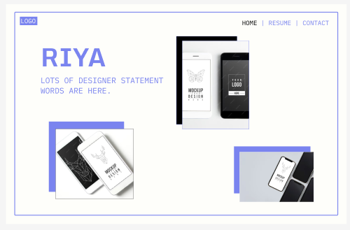

https://blog.uxfol.io/ux-portfolio-examples/

Today I got inspired by Klaudia Simon and Ákos Izsák's article "23 Succesful
UX Portfolio Examples and a Guide for Creating Yours.

This article gave a wealth of valuable information from concrete steps to follow to create a succesful UX portfolio to learning by example by presenting cutting edge examples. I decided to try out this advice and 
ideas myself through a quick figma mockup of a potential frontpage of my 
UI/UX portfolio. I was very inspired by the minimalistic, brutalist UI styles that masterfully use whitespace and sans serif text for a sleek, 
modern approach. I personally throught the examples could use more contrast so I decided use my favorite shade of saturated purple to embue my personality and add a high contrast pop against an off white background. I also made the background an off white yellow hue to better complement the purple accents. I have always been a fan of retro, typewriter like fonts
with a modern approach so I used fonts that best embody that! Another personal spin I implemented was the organized chaos of different sized image displays that lack order but fit toegther in the expanse of white space. I made sure to follow the advice of the article of using the
same style mockups through royalty free ui images and also making sure they are front and center on my home page. I also added the key navigation mentioned like home, resume, and contacts. 
