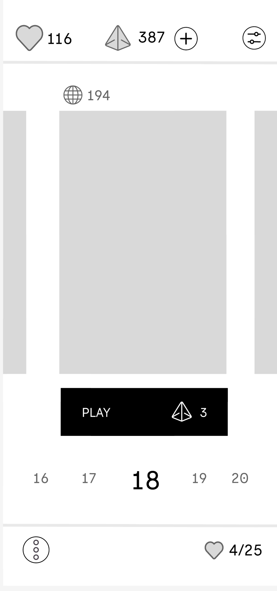
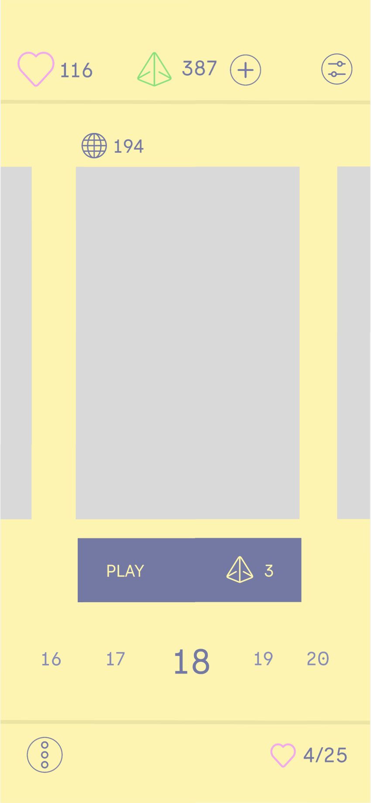
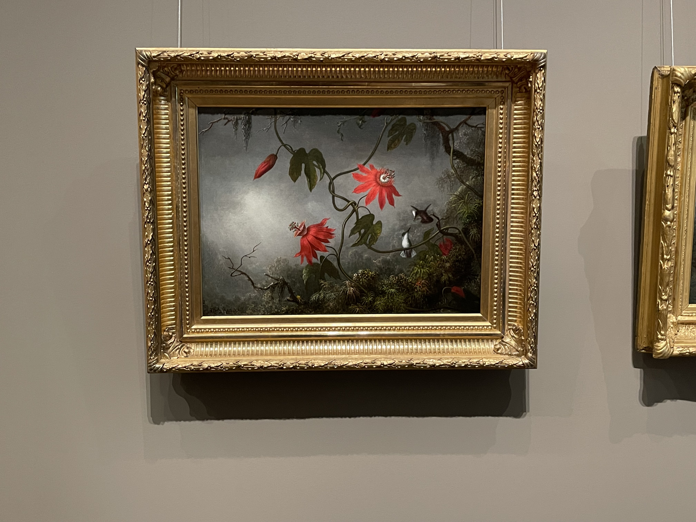

## Projects

Here are some of the projects I've worked on:

- **Final Project**: StyleCycle

Initial Prototype
<iframe style={{border: "1px solid rgba(0, 0, 0, 0.1)"}} width="800" height="450" src="https://embed.figma.com/design/UK9uUpAhDIBDZ92RVxjQA3/Final-Project-Design-System?node-id=0-1&embed-host=share" allowfullscreen></iframe>

User Testing Changes
<iframe style={{border: "1px solid rgba(0, 0, 0, 0.1);"}} width="800" height="450" src="https://embed.figma.com/design/vMADeAuVf2QUHi2hdHYOT4/Final-Project-Design-System-(Copy)-(Copy)?node-id=0-1&embed-host=share" allowfullscreen></iframe>

Protoype
<iframe style={{border: "1px solid rgba(0, 0, 0, 0.1);"}} width="800" height="450" src="https://embed.figma.com/proto/vMADeAuVf2QUHi2hdHYOT4/Final-Project-Design-System-(Copy)-(Copy)?node-id=37-2&node-type=canvas&scaling=min-zoom&content-scaling=fixed&page-id=0%3A1&starting-point-node-id=37%3A2&show-proto-sidebar=1&embed-host=share" allowfullscreen></iframe>

- **Color Harmony**:

- **Finding Inspiration**:
Passion Flowers and Hummingbirds by Martin Johnson Heade

- **Portfolio Design Ideation**:
 
